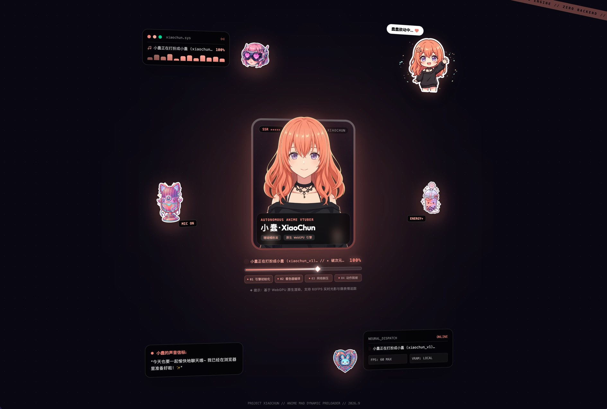
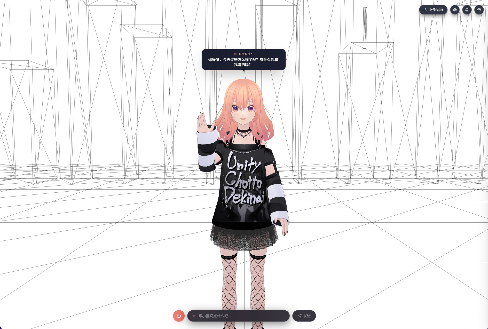

<p align="center">
  
</p>

<h1 align="center">Project XiaoChun</h1>

<p align="center">
  <b>100% 浏览器原生二次元陪伴角色 — 本地 LLM + EMAGE 动作 + Edge-TTS,零后端</b>
</p>

<p align="center">
  <a href="README.md">English</a> •
  <a href="README-CN.md">简体中文</a>
</p>

---

> [!IMPORTANT]
> **声明**:本项目是一个**浏览器原生 AI 陪伴角色研究实验**。旨在验证 100% 客户端 AI 推理栈 (WebLLM / WebGPU / ONNX Runtime Web) 与 Cloudflare Workers 边缘 TTS 的可行性,**不建议直接用于商业化生产部署**。

---

## 📖 项目简介 (Overview)

**Project XiaoChun (小蠢)** 是一个完全运行在浏览器里的二次元陪伴角色。角色用 `@pixiv/three-vrm` 渲染,采用 MToon NPR 着色,坐在沉浸式线稿户外场景中;**所有 AI 推理都在你当前的浏览器标签页里跑** —— 没有 Python 后端,没有服务器 GPU。

进场是 2D MAD 预载破次元到 3D —— 镜头从 3.3 倍远景推近,splash 同步淡出。你跟她说话。她思考(WebLLM Qwen2.5 1.5B q4f16_1,失败降到 0.5B;思考模式可关)、她开口说话(Edge-TTS 走 Cloudflare Workers WebSocket)、她全身动作实时跟上(EMAGE ONNX 在 Dedicated Web Worker 里)。模型没就绪时输入会排队,不会丢字。对话条菜单可从 WebLLM 预置表换模型,也可在**应用内配置对话框**接入任意 **OpenAI 兼容 自定义服务**(Ollama / LM Studio / vLLM / LocalAI / 云厂商)——AES-GCM 加密存在 IndexedDB。

UI 走 **TanStack Start SSR + i18next** 水合,**完整支持简体中文 / English / 日本語 三语切换**,并且按 iOS HIG 44 pt / Material 48 dp 触屏规范做了移动端优先适配。

---

## 🖼️ 项目预览 (Preview)

<p align="center">
  <br/>
  <i>进场预载：2D MAD 卡面，加载完成后破次元进入 3D</i>
</p>

<p align="center">
  <br/>
  <i>3D 舞台：MToon NPR 角色、线稿场景、头顶气泡与底部对话条</i>
</p>

---

## ✨ 核心特性 (Key Features)

### 🎭 VRM 核心引擎与模块化子系统 (VRM Engine & Modular Architecture)
* **VRM 1.0 渲染中枢**:基于 `@pixiv/three-vrm` 与 MToon NPR 着色，核心引擎经深度模块化解耦（`VRMEngine` 体积直降 55%），由 5 大专业子系统协同编排：
  * **线稿世界环境 (`LineworkWorld`)**:纯代码程序化构建太阳与 12 条发散光线、19 栋线稿建筑天际线、网格地面与 5 种造型风格化树（松塔/伞盖/黑松/笔柏/椭圆）—— **纯白底黑线，零外部贴图**。
  * **影棚 6 通道专业光照 (`StudioLighting`)**:主日光（带 2048 柔和阴影相机）/ 半球天光 / 面部射灯 / 背后轮廓 / 腿部立体 / 双臂专属高光，各通道独立可控。
  * **MToon 材质管线 (`VRMMaterialManager`)**:全自动网格材质语义分类（skin / hair / eyes / clothing），动态注入片元着色器 Uniform `uMatSaturation` 并在 Shader 层实施灰度混合校色；头发饱和度精细调优（默认 1.50），光泽通透。
  * **视线与微表情交互 (`GazeController`)**:陪伴式注视、微扫视、生理仰俯/偏航安全角限位、自然生理眨眼与思考神态摇头。
  * **3D 空间气泡追踪 (`BubbleTracker`)**:头部世界坐标到屏幕 2D 像素投影，带 1.5px 移动死区过滤算法，直接操控 DOM 变换，避免 60~120 FPS React 重渲染。
* **运行时上传 VRM**:右上角上传按钮，支持任意标准 VRM 1.0 角色无缝导入。

### 🩰 统一万能动作融合管线 (Universal Motion Pipeline)
* **万能动作零门槛接入 (`playMotion`)**：无论是 VRMA 文件 URL、ArrayBuffer 二进制流还是 `THREE.AnimationClip`，均通过单一管线一键播放；自动完成骨骼重定向、Hips 偏移归一化，支持全身（`all`）与半身（`upperBody`）部位遮罩。
* **电影级五次平滑步阶曲线补帧 (Quintic Smootherstep Inbetweening)**：废除机械线性插值，基于 $6t^5 - 15t^4 + 10t^3$ 曲线在生理时间窗（0.70s~0.88s）内逐帧自适应 Slerp 插补，首尾速度与加速度严格连续，彻底消灭动作启停时的撕扯与跳帧。
* **分层动作姿态求值图 (Layered Pose Hierarchy)**：
  * **Layer 0 (Base)**：`NaturalIdleSystem` 仿生自然待机（多频胸腹呼吸、8 字骨盆慢速重心微摆、真十指松弛微卷）；
  * **Layer 1 (Main Action)**：`vrma` 思考动作、`emage` 语音手势与通用动作剪辑平滑 Crossfade 流转；
  * **Layer 2 (Locomotion)**：`BodyTurnSystem` 物理转身步态，仅通过 `LOWER_BODY_MASK`（双腿与骨盆）加权覆盖，绝不污染上身姿态与视线；
  * **Post-Pass**：`FootIK` 脚部物理贴地解算。
* **Three.js `stopAllAction` 陷阱消除**：彻底封堵 Three.js 在 stop 动作时触发 `restoreOriginalState()` 把骨骼清零重置为 T-Pose 的顽疾，在动作停止前后原子化保护真实人体姿态。
* **视线逆四元数解耦 (LookAt Decoupling via Inverse Quaternions)**：打姿态快照时乘以逆四元数剔除乘法视线偏移，彻底消除转身或停步瞬间头部被拉扯偏动的突变顿挫。
* **全自动生命周期闭环**：单次动作播完自动启动淡出过渡，从容回归待机并触发回调，无需外部状态机额外干预。

### 🧠 100% 浏览器端 AI 推理栈 (Browser-Side AI)
* **大语言模型 (WebLLM,默认)** — [`@mlc-ai/web-llm`](https://github.com/mlc-ai/web-llm) 默认 **Qwen2.5 1.5B (q4f16_1)**，低配设备自动降级至 0.5B。轻量高效，在移动端与低显存设备上兼顾推理速度与回复质量；对话条菜单可随时热切换模型或开关思考模式；回复语言随用户提问语系自适应匹配。
* **大语言模型 (OpenAI 兼容自定义服务,可选)** — 应用内配置对话框一键接入任意 OpenAI 兼容 HTTP 服务:Ollama / LM Studio / vLLM / LocalAI / 云厂商(OpenAI、DeepSeek、Qwen API 等)。Provider 配置 AES-GCM 加密存在 IndexedDB;激活后 WebLLM **不会**预热,省 1-2 GB 显存 + 模型下载带宽。
* **统一 Provider 工厂 (`chatWorkflow.runChat`)** — WebLLM 与自定义 provider 共享同形 `runChat(opts) → string` 契约;dispatcher 通过 `ChatProvider` 注册表轮询,选第一个 `isActive` 命中的。加新 provider = 注册一个描述符。
* **动作生成** — **EMAGE** 全身动作 (ONNX Runtime Web) 在 Dedicated Web Worker 中运行，时序高斯滤波平滑。
* **语音合成** — **Edge-TTS 晓伊 (XiaoyiNeural, zh-CN, +10 Hz)**，基于 [`edge-tts-universal`](https://github.com/Sterznode/edge-tts-universal)；网络传输前智能剥离 emoji。
* **LLM + TTS + EMAGE 一体编排**：chat director 全链路统一协调，主线程满帧 60 FPS 丝滑驱动。

### ⚡ 智能分段流式语音管线 (Streaming Speech Pipeline)
* **智能分句切片 (Smart Chunking)**：打破千字长文生成等待瓶颈，统一按 30~60 字与自然语法标点（`。！？!?\n` 或逗号长句）断句，语气自然抑扬顿挫。
* **全切片 TTS 零延迟并发预取**：纯网络 I/O 全部切片并行下载，彻底消除语音合成等待延迟。
* **双条件预缓冲起播 (Dual-Condition Pre-buffering)**：兼顾比例（$\lceil N / 3 \rceil$）与上限封顶（最多预缓冲 2 段，约 8~12s 语音），1~2 段极速开播，多段长文缓冲 2 段即起播，后续段落后台源源不断产生，告别长文久等。
* **跨段潜空间自回归种子连续继承 (Latent Seed Carryover)**：Worker 内部继承上一段尾部 4 帧潜空间种子 (`continueFromPrevious`)，分段动作在数学与物理上完全等同于单次长程自回归推理，消除断接割裂。
* **纯生理角速度与阻尼弹簧无感切段过渡**：废除时间倒计时生硬插值，基于真实人体生理极限（手臂 2.2 rad/s，颈头 1.6 rad/s，躯干 1.2 rad/s）+ 指数弹簧阻尼自适应收敛，无论段间动作差异多大均平滑自收敛。
* **自适应言谈间歇待机 (`SpeakIdleSystem`)**：段间等待时角色不再定格成蜡像，根据前序手势随机应变 —— 身前手势保持悬浮交谈态（带呼吸浮沉与超 1.5s 极缓重力自然微沉降）；严格按 VRM 1.0 真指节沿 Z 轴实施微脉搏舒缩；配合意识流头部微偏转与倾听微点头。
* **控制台多切片动态表格看板**：`console.table` 实时呈现各段 TTS、EMAGE 推理、播放状态与切段过渡模式。
* **气泡流式进度呼吸徽标**：头顶跟随气泡顶栏「来啦来啦～」右侧实时指示 `🟢 1 / 5` 进度胶囊，释放正文空间。

### 💾 端侧持久化多级记忆系统 (Client-Side Memory System)
* **100% 纯本地隐私安全 (IndexedDB)**：基于浏览器原生 IndexedDB（`xiaochun-memory` 独立数据库），对话轮次、用户称呼、性格喜好与长期记忆全部保留在用户设备本地，绝不向任何云端服务器回传。
* **三层记忆分级架构 (3-Tier Memory Architecture)**：
  * **短期对话轮次 (Short-Term Turns)**：自动维护最近 $N$ 轮对话上下文（默认保留 6 轮，单轮截断 180 字符，由 `APP_CONFIG.memory.shortTermTurns` 控制），保障即时对话连贯性。
  * **实体画像提取 (Entity Profile)**：支持中 / 英 / 日多语言正则智能抓取用户称呼（如“我叫…”、“叫我…”、“my name is…”、“call me…”、“私は…”）、偏好倾向（“我喜欢…”、“我不喜欢…”、“i like…”）与关键事实，去重收录并持久化至画像配置。
  * **长期摘要笔记与相关度检索 (Long-Term Notes & n-gram Retrieval)**：自动沉淀对话摘要笔记（长期存储上限 80 条）；新对话发起时，通过 n-gram 文本相似度打分算法 (`gramScore`) 快速召回最相关的 Top-K（默认 4 条）历史笔记。
* **免阻塞异步写入与动态提示词注入**：
  * **异步落库**：对话结束后台异步执行 `rememberTurn()`，零阻塞主线程渲染、手势与音频播放。
  * **动态记忆注入**：发起生成前瞬时完成 `recallForChat()`，将提取的实体画像与召回的长期笔记智能封装进小蠢的 LLM 系统提示词（`appendMemoryToSystem`），支持中 / 英 / 日多语系个性化称呼（如“你还记得对方：称呼 xxx。喜欢 xxx…”、“以前聊过的事：…”），并指示模型优先接续最新话题。

### 🌐 国际化与 SSR 水合 (i18n & SSR)
* **TanStack Start** 全栈 SSR,基于 Cookie 的语言水合 —— **客户端首屏不闪语言**。
* **三语齐备**:简体中文 / English / 日本語。
* **系统提示词**:小蠢是陪伴角色,用用户这条消息的语言回答,不跟 UI 语言走。
* **shadcn 风格下拉菜单**(Radix UI 原语)右上角切换语言。

### 📱 移动端优先 UI (Mobile-First)
* **iOS HIG 44 pt / Material 48 dp** 触屏规范贯穿全局。
* **底部对话输入框 ≥ 40 px**,字号 16 px(防止 iOS Safari 聚焦自动缩放)。
* **Tailwind CSS + tailwindcss-animate** 微交互 + 液态玻璃视觉。
* **顶部操作条**:上传 VRM / 语言切换 / GitHub;调试面板只在 localhost 出现。
* **对话条**:输入可排队、菜单换模型/思考模式、发送。
* **头顶跟随气泡**:直接改 DOM `transform`,带死区,不跟 60 FPS 一起刷 React。
* **移动端**:预载贴纸保留,ChatBar 避开底部安全区。

### 🛠️ 开发工具链 (Dev Tooling)
* **调试抽屉**(仅本地):表情切换 / 6 路灯光 / FOV / 全局亮度 / 材质饱和度预设。
* **Cloudflare Workers**(`src/server.ts`):生产环境统一承载 TanStack Start SSR 与原生 WebSocket Edge-TTS 流式代理。
* **Vite dev 中间件**(`vite/localApiPlugin.ts`):本地开发使用 Miniflare 虚拟运行时，与线上环境 100% 同构。`/api/tts` 默认转发到 `TTS_PROXY_URL`(部署的 Cloudflare Worker),未设置时回退本地 `edge-tts-universal`。
* **单一可信源**:`src/config.ts` 集中管理光照 / 相机 / 表情 / 饱和度 / LLM / R2 模型参数。

---

## 🛠️ 技术栈 (Tech Stack)

| 架构层 | 技术方案 | 说明 |
| :--- | :--- | :--- |
| **3D 核心引擎** | [three.js 0.185](https://threejs.org) + [@pixiv/three-vrm 3.5](https://github.com/pixiv/three-vrm) | 模块化解耦中枢（5 大专业子系统：线稿世界 / 6 通道影棚打光 / MToon 饱和度注入 / 视线交互 / 3D 气泡追踪） |
| **动作融合管线** | 自研分层万能动作管线 (`MotionPipeline`) | 全姿态五次平滑步阶曲线补帧、部位遮罩、解剖角速度限幅、逆四元数解耦与防 T-Pose 保护 |
| **应用框架** | [React 19](https://react.dev) + [TanStack Start](https://tanstack.com/start) | 全栈 SSR + Cookie 水合 i18n |
| **路由** | [TanStack Router](https://tanstack.com/router) | 类型安全文件路由 |
| **大语言模型** | [WebLLM](https://github.com/mlc-ai/web-llm) | Qwen2.5 1.5B q4f16_1 WebGPU 流式推理 (自动降级至 0.5B) |
| **端侧记忆** | IndexedDB + 自研三层画像管线 | 纯本地多级记忆持久化、实体画像提取与 n-gram 语义召回 |
| **动作生成** | EMAGE + [ONNX Runtime Web](https://onnxruntime.ai) | Dedicated Web Worker 全身动作生成 |
| **语音合成** | [edge-tts-universal](https://github.com/Sterznode/edge-tts-universal) | 晓伊 zh-CN +10 Hz, emoji 剥离 |
| **边缘运行时** | [Cloudflare Workers](https://developers.cloudflare.com/workers/) + [@cloudflare/vite-plugin](https://developers.cloudflare.com/workers/framework-guides/web-apps/tanstack-start/) | SSR 渲染 + WebSocket TTS + 静态资产直连 |
| **对象存储** | [Cloudflare R2](https://developers.cloudflare.com/r2/) | 托管 504 MB ONNX 全身模型，免出站流量费 |
| **样式** | [Tailwind CSS 4](https://tailwindcss.com) + `tailwindcss-animate` | 液态玻璃视觉,移动端优先 |
| **国际化** | [i18next](https://www.i18next.com) + [react-i18next](https://react.i18next.com) | 三语,SSR 水合 |
| **UI 原语** | [Radix UI](https://www.radix-ui.com) (DropdownMenu, Slot) | shadcn 风格组件 |
| **语言** | [TypeScript 6](https://www.typescriptlang.org) | 端到端严格类型 |
| **构建** | [Vite 8](https://vite.dev) + `@cloudflare/vite-plugin` | 自动剔除超大静态资产，生产极致瘦身 |

---

## 🚀 快速开始与部署指南 (Quick Start & Deployment)

环境要求:**Node.js 18+**,包管理器 **pnpm**(`preinstall` hook 强制)。

### 本地开发 (Local Development)

```bash
# 1. 安装依赖
pnpm install

# 2. 启动开发服务器 (SSR + Miniflare 本地边缘运行时)
pnpm dev          # → http://localhost:5185

# 3. 生产打包并预览
pnpm build        # 构建输出 dist/client 与 dist/server (Worker)
pnpm preview      # 预览生产 Worker 行为
```

---

### ☁️ Cloudflare Workers 部署 (Cloudflare Deployment)

本项目全面采用 **Cloudflare 现代 Workers + Static Assets 架构**（而非旧版 Pages），兼顾全栈 SSR 极速注水与原生 WebSocket 流式 TTS。

#### 方式 A：本地终端一键发布（推荐 · 秒级上线）
```bash
# 一键完成生产构建并直接推送至 Cloudflare 边缘网络
pnpm deploy
# 等价于: pnpm build && wrangler deploy
```
*首次发布若未登录，将自动调起浏览器完成 OAuth 授权。发布成功后，在 Cloudflare 控制台将自定义域名（如 `xiaochun.firetable.tech`）绑定至该 Worker 即可。*

#### 方式 B：GitHub 自动 CI 部署（Workers Builds）
如需通过 `git push` 自动触发云端构建发布：
1. 登录 Cloudflare 控制台 -> 进入 **Workers & Pages** -> **Create Application** -> 切换到 **Workers** 标签；
2. 选择 **Connect to Git** 关联此 GitHub 仓库；
3. **构建设置（⚠️ 关键注意事项）**：
   * **根目录 (Root directory)**：**必须留空（Blank）！切勿填写 `/`**，填 `/` 会导致容器将路径误认为 Linux 系统根目录而挂起；
   * **构建命令 (Build command)**：`pnpm build`
   * **部署命令 (Deploy command)**：`npx wrangler deploy`
4. 关联成功后，后续任意 Git 提交推送到 `main` 分支均会自动构建上线。

---

## 📁 项目结构 (Project Structure)

```text
Project-XiaoChun/
├── public/                    # 静态资产目录 (通过 Cloudflare Workers Assets 托管)
│   ├── xiaochun_v1.vrm        # 默认 VRM 角色模型 (18 MB)
│   ├── thinking.vrma          # 待机思考动作循环
│   ├── _headers               # 静态资源强缓存与安全响应头
│   ├── robots.txt / sitemap.* # SEO 搜索引擎爬虫协议
│   ├── llms.txt / llms-full.* # AI 代理与大模型 GEO 协议规范
│   └── logo.png / favicon.*   # 品牌与图标资产
├── wrangler.jsonc             # Cloudflare Workers 声明式配置文件
├── src/
│   ├── routes/                # TanStack Start 文件路由
│   │   ├── __root.tsx         # 根布局 (i18n SSR 水合、GEO JSON-LD 与元信息)
│   │   └── index.tsx          # 首页主路由
│   ├── components/            # React UI 组件 (TopHeader, ChatBar, HeadBubble, DevDrawer…)
│   │   └── ui/                # Radix UI 原语封装 (button, dropdown-menu, tooltip)
│   ├── core/                  # 3D 渲染与场景中枢 (解耦 Facade 架构)
│   │   ├── vrmEngine.ts       # 核心引擎调度中枢 (轻量 Facade、渲染循环、VRM 加载挂载)
│   │   ├── scene/             # 线稿背景世界 (lineworkWorld.ts: 太阳光芒/大楼/地面/树木)
│   │   ├── lighting/          # 6 通道影棚打光 (studioLighting.ts: 主光/半球光/补光/高光)
│   │   ├── material/          # MToon 材质管理 (vrmMaterialManager.ts: Shader 饱和度注入)
│   │   └── ui/                # 空间 UI 投影 (bubbleTracker.ts: 头部 3D 坐标转 2D 气泡)
│   ├── motion/                # 动作系统 (统一万能管线 + 仿生拟真姿态)
│   │   ├── pipeline/          # 统一万能动作融合管线 (MotionPipeline / PoseBuffer / UniversalMotion)
│   │   ├── motionTransition.ts # 五次平滑步阶曲线补帧 (Quintic Smootherstep Slerp)
│   │   ├── gazeController.ts  # 人机视线伴随系统 (眼部微颤/眨眼/生理限位/思考摇头)
│   │   ├── naturalIdle.ts     # 多频仿生呼吸待机与十指微卷 (Layer 0)
│   │   ├── speakIdle.ts       # 言谈微停顿手势悬浮自适应与缓沉
│   │   ├── bodyTurn.ts        # 骨盆与下半身物理转身步态 (Layer 2)
│   │   ├── footIK.ts          # 脚部物理贴地解算器 (Post-Pass)
│   │   ├── emagePlayer.ts     # EMAGE 语音手势驱动与时序高斯滤波
│   │   ├── emageWorker.ts     # ONNX Runtime Web 独立 Dedicated Worker
│   │   ├── vrmaPlayer.ts      # VRMA 动画播放驱动器
│   │   └── vrmaRetarget.ts    # VRMA 骨骼重定向与标准化
│   ├── memory/                # 端侧持久化多级记忆 (IndexedDB 存储 / 实体画像提取 / n-gram 检索)
│   ├── llm/                   # LLM 层 — WebLLM + 自定义 OpenAI 兼容 provider 工厂
│   │   ├── webLLMProvider.ts   # WebLLM 引擎 + runChat
│   │   ├── customProvider/     # 自定义 OpenAI 兼容 provider
│   │   │   ├── index.ts        #   公共导出
│   │   │   ├── client.ts       #   fetch + SSE + probeProvider
│   │   │   ├── crypto.ts       #   AES-GCM API key 加密 (PBKDF2)
│   │   │   ├── speech.ts       #   自定义 provider 的 runChat
│   │   │   ├── store.ts        #   IndexedDB profile 持久化
│   │   │   └── types.ts        #   ProviderProfile + KNOWN_TEMPLATES
│   │   ├── chatTypes.ts        # 共享 RunChatOptions / ChatProvider / ChatMessage
│   │   ├── chatWorkflow.ts     # 跨 provider 调度 + 输出清洗 + 兜底台词
│   │   ├── activeKey.ts        # 统一 custom:xxx / webllm:xxx active key
│   │   └── progress.ts         # LLM 进度事件总线
│   ├── director/
│   │   └── chatDirector.ts    # LLM → TTS → EMAGE 流式全链路状态编排
│   ├── i18n/                  # zh-CN / en / ja 翻译字典 + 服务端 Cookie 提取
│   ├── styles/
│   │   └── main.css           # Tailwind v4 @theme tokens + 液态玻璃样式
│   ├── App.tsx                # 应用主体与事件总线
│   ├── client.tsx             # 客户端 Hydration 注水入口
│   ├── server.ts              # Cloudflare Worker 统一入口 (SSR 流式渲染 + /api/tts WebSocket 直连)
│   ├── router.tsx             # TanStack Router 实例工厂
│   ├── routeTree.gen.ts       # 自动生成的类型安全路由树
│   └── config.ts              # 单一可信源 (R2 / 相机 / 6路灯光 / 饱和度 / LLM / 表情)
├── vite.config.ts             # Vite 8 + TanStack Start + @cloudflare/vite-plugin
├── vite/                      # 自定义 Vite 插件 (从 vite.config.ts 抽出)
│   ├── localApiPlugin.ts       # /api/tts 开发中间件 (TTS 转发 + EU 出口回退)
│   └── dropDockerfatAssets.ts # 剥离 25 MiB+ WASM blob 以适配 Cloudflare Pages 上限
├── .env.example               # 全部环境变量文档化模板 (复制到 .env.local)
└── tsconfig.json
```

---

## 🌐 国际化与 SSR 水合 (i18n & SSR Hydration)

语言通过 `lang` cookie 持久化,SSR 阶段由 `@tanstack/react-start/server` 的 `getCookie()` 解析 —— 用 `createServerOnlyFn` 包裹以保证不进客户端 bundle。客户端则从 `document.cookie` 读同一个 cookie,确保 SSR 渲染的 HTML 与客户端首次水合 **零 mismatch**。

切换语言时:
1. 更新 `lang` cookie。
2. 调用 `i18n.changeLanguage()`。
3. 所有 `t(...)` 消费者无刷新重渲染。

---

## 📄 许可证 (License)

本项目基于 **MIT 许可证** 开源。

> **第三方素材** (默认场景使用):
> * `public/xiaochun_v1.vrm` — VRM 角色模型,使用 **[VRoid Studio](https://vroid.com/en/studio)** (Pixiv Inc.) 生成。遵循 **VRoid Studio 许可证**:允许个人使用、修改及非商业再分发(需注明出处)。若需商业使用,请参阅 [VRoid Studio 许可证条款](https://vroid.com/en/license) 或联系 Pixiv Inc. 另行协商。
> * `public/thinking.vrma` — VRM 动作。**许可证不明**,分发前请自行确认。

`src/server.ts` 的 `/api/tts` 通过 [`edge-tts-universal`](https://github.com/Sterznode/edge-tts-universal) 公开协议调用 Microsoft Edge-TTS。`TRUSTED_CLIENT_TOKEN` 是公开的共享 token(所有开源 Edge-TTS 实现都用同一个值),**不是个人密钥**。

---

## 🙏 致谢 (Acknowledgements)

* [pixiv / three-vrm](https://github.com/pixiv/three-vrm) — VRM 运行时
* [Pixiv / VRoid Studio](https://vroid.com/en/studio) — 默认角色制作工具
* [MLC AI / WebLLM](https://github.com/mlc-ai/web-llm) — 浏览器内 LLM
* [Sterznode / edge-tts-universal](https://github.com/Sterznode/edge-tts-universal) — Edge-TTS 桥接
* [TanStack Start](https://tanstack.com/start) — 全栈 React 框架
* [Tailwind CSS](https://tailwindcss.com) — 原子化样式
* [Qiuner / Qiuner.github.io](https://github.com/Qiuner/Qiuner.github.io)(`src/worlds/linework/`)— 线稿户外场景视觉灵感来源
* [Animation Inc.](https://www.animation.inc) — 亲身体验过他们的 Ani-2 端侧实时全身动作产品后,萌生了"在浏览器里也能跑通"的想法;本项目自研的 EMAGE 管线,就是这次动手的尝试
* [PantoMatrix / EMAGE](https://github.com/PantoMatrix/PantoMatrix)([Yi 等人,CVPR 2024](https://pantomatrix.github.io/EMAGE/))— 驱动本项目对话时手势生成的 ONNX 全身协同动作模型
* [VolgaGerm / emage-onnx-export](https://github.com/VolgaGerm/emage-onnx-export)— PyTorch → ONNX 的导出脚本,以及我们浏览器里直接跑的那批预转换 `.onnx` 权重
