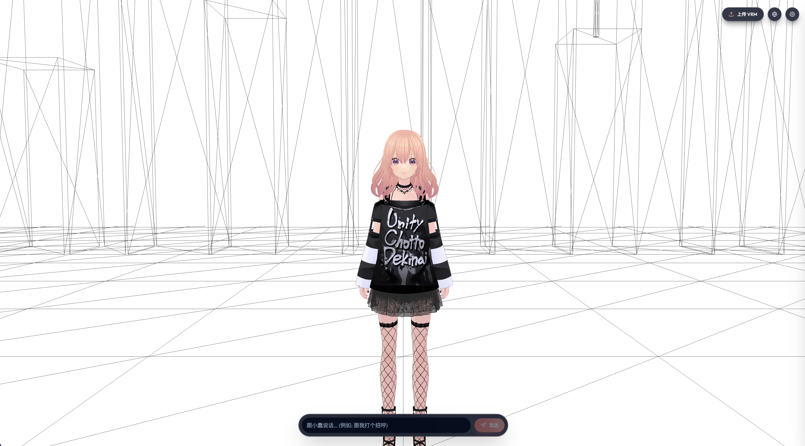

<p align="center">
  
</p>

<h1 align="center">Project XiaoChun</h1>

<p align="center">
  <b>A 100% browser-native anime VTuber — local LLM + EMAGE motion + Edge-TTS, zero backend</b>
</p>

<p align="center">
  <a href="README.md">English</a> •
  <a href="README-CN.md">简体中文</a>
</p>

---

> [!IMPORTANT]
> **Notice**: This repository is a **Browser-native AI VTuber Research Project & Experimental Prototype**. It explores 100% client-side AI stacks (WebLLM / WebGPU / ONNX Runtime Web) and Cloudflare Pages edge functions for TTS. **It is not recommended for direct commercial production deployment.**

---

## 📖 Overview

**Project XiaoChun (小蠢)** is a fully browser-native anime VTuber companion. The character renders through `@pixiv/three-vrm` with MToon NPR shading inside an immersive linework outdoor scene; all AI inference runs in your browser tab — no Python backend, no server GPUs.

You talk to her. She thinks (WebLLM Qwen3 0.6B on WebGPU), emotes (EMAGE ONNX in a Dedicated Web Worker), speaks (Edge-TTS via Cloudflare Pages Function / Vite dev middleware), and moves her whole body in real time.

The UI is fully **SSR-hydrated multi-language** (zh-CN / en / ja) via TanStack Start + i18next, and is mobile-first responsive (iOS HIG 44 pt / Material 48 dp touch targets).

---

## 🖼️ Preview

<p align="center">
  <br/>
  <i>VRM character rendered with MToon NPR shading, immersed in a procedural linework outdoor scene</i>
</p>

---

## ✨ Key Features

### 🎭 VRM Character & Scene
* **VRM 1.0 rendering** via `@pixiv/three-vrm` with MToon NPR shading, soft Japanese-anime lighting, and **6 independent light channels** (dir / hemi / front / fill / leg / arm) with live tuning.
* **Linework outdoor scene**: procedural sun, 19 wireframe buildings (5 archetypes), 5 stylized trees (conifer / fan / layered / cypress / vertical-oval), and a wireframe ground — 100% white-on-white, no textures.
* **Companion gaze system**: level head + micro-saccades + additive look-at tracking with comfortable pitch limits.
* **Upload your own VRM** at runtime via the top-bar upload button.

### 🧠 100% Browser-Side AI Stack
* **LLM** — [`@mlc-ai/web-llm`](https://github.com/mlc-ai/web-llm) running **Qwen3 0.6B (q4f16_1)** on WebGPU. Thinking phase and streaming completion both live in the browser tab.
* **Motion** — **EMAGE** full-body motion generation (ONNX Runtime Web) inside a Dedicated Web Worker, with sentence-level streaming, temporal Gaussian smoothing, and natural idle blends.
* **TTS** — **Edge-TTS 晓伊 (XiaoyiNeural, zh-CN, +10 Hz)** via [`edge-tts-universal`](https://github.com/Sterznode/edge-tts-universal); emoji stripped from speech text to avoid prosody glitches.
* **LLM + TTS + EMAGE orchestrated** by a streaming chat director that emits per-utterance actions without UI freeze.

### 🌐 i18n & SSR
* **TanStack Start** full-stack SSR with cookie-based language hydration — no client-side language flash.
* **3 languages shipped**: 简体中文 / English / 日本語.
* **Per-language system prompts** — the LLM responds in the user's language even when prompted cross-language.
* **shadcn-style dropdown** in the top-right for language switching (Radix UI primitive).

### 📱 Mobile-First UI
* **iOS HIG 44 pt / Material 48 dp** touch targets throughout.
* **Bottom chat input ≥ 40 px** with 16 px text (prevents iOS Safari auto-zoom on focus).
* **Tw + tailwindcss-animate** micro-interactions; liquid-glass aesthetic.
* **Top-right action bar** — upload, language switcher, dev panel toggle.
* **Floating speech bubble** that follows the character's head with smooth `transform` interpolation.

### 🛠️ Dev Tooling
* **Debug drawer** with expression picker, per-channel light sliders, FOV control, global light multiplier.
* **Cloudflare Pages Functions** (`functions/api/tts.ts`) — production TTS via edge runtime.
* **Vite dev middleware** (`vite.config.ts → localApiPlugin`) — local TTS via the same endpoint, zero Python.
* **Single source of truth**: `src/config.ts` consolidates all lighting / camera / expression config.

---

## 🛠️ Tech Stack

| Layer | Technology | Description |
| :--- | :--- | :--- |
| **3D Engine** | [three.js 0.185](https://threejs.org) + [@pixiv/three-vrm 3.5](https://github.com/pixiv/three-vrm) | MToon NPR shading, OrbitControls, EffectComposer |
| **App Framework** | [React 19](https://react.dev) + [TanStack Start](https://tanstack.com/start) | Full-stack SSR with cookie-based i18n hydration |
| **Router** | [TanStack Router](https://tanstack.com/router) | Type-safe file-based routing |
| **LLM** | [WebLLM](https://github.com/mlc-ai/web-llm) | Qwen3 0.6B q4f16_1 on WebGPU, streaming |
| **Motion** | EMAGE + [ONNX Runtime Web](https://onnxruntime.ai) | Full-body generation in Dedicated Web Worker |
| **TTS** | [edge-tts-universal](https://github.com/Sterznode/edge-tts-universal) | XiaoyiNeural zh-CN +10 Hz, emoji-stripped text |
| **Edge** | [Cloudflare Pages Functions](https://developers.cloudflare.com/pages/functions/) | `/api/tts` endpoint, 0 cold start |
| **Styling** | [Tailwind CSS 4](https://tailwindcss.com) + `tailwindcss-animate` | `liquid-glass` aesthetic, mobile-first |
| **i18n** | [i18next](https://www.i18next.com) + [react-i18next](https://react.i18next.com) | 3 languages, SSR-hydrated |
| **UI Primitives** | [Radix UI](https://www.radix-ui.com) (Dropdown Menu, Slot) | shadcn-style components |
| **Language** | [TypeScript 6](https://www.typescriptlang.org) | Strict typing end-to-end |
| **Build** | [Vite 8](https://vite.dev) + [Vinxi](https://vinxi.vercel.app) | Dev middleware, edge-compatible build |

---

## 🚀 Quick Start

Requirements: **Node.js 18+**, package manager: **pnpm** (enforced via `preinstall` hook).

```bash
# 1. Install dependencies (will trigger TTS dev middleware setup)
pnpm install

# 2. Start dev server (TTS / VRM / WebLLM all in-browser)
pnpm dev          # → http://localhost:3000

# 3. Production build
pnpm build        # outputs to .output/ (Cloudflare Pages compatible)
pnpm preview      # preview the production build locally
```

> **First-run note**: WebLLM downloads the Qwen3 0.6B q4f16_1 model (~400 MB) on first launch and caches it in the browser. Subsequent visits load instantly from `CacheStorage`.

---

## 📁 Project Structure

```text
Project-XiaoChun/
├── public/                    # Static assets
│   ├── xiaochun_v1.vrm        # Default VRM character model (18 MB)
│   ├── thinking.vrma          # Idle thinking animation loop
│   ├── logo.png / favicon.*   # Brand assets
├── functions/
│   └── api/
│       └── tts.ts             # Cloudflare Pages Function — /api/tts edge endpoint
├── src/
│   ├── routes/                # TanStack Start file-based routes
│   │   └── __root.tsx         # Root layout (i18n SSR hydration here)
│   ├── components/            # React UI components (TopHeader, ChatBar, HeadBubble…)
│   │   └── ui/                # shadcn-style primitives (button, dropdown-menu, input)
│   ├── core/
│   │   └── vrmEngine.ts       # 3D scene assembly, light channels, render loop
│   ├── motion/                # VRMA / EMAGE players + Web Worker
│   ├── llm/                   # WebLLM integration + per-language prompts
│   ├── director/
│   │   └── chatDirector.ts    # LLM → TTS → EMAGE streaming pipeline
│   ├── i18n/                  # zh-CN / en / ja translation files + SSR helpers
│   │   ├── zh-CN.ts / en.ts / ja.ts
│   │   ├── index.ts           # createI18n, changeLang, readClientLang
│   │   └── server.ts          # createServerOnlyFn wrapper for getCookie
│   ├── styles/
│   │   └── main.css           # Tailwind v4 @theme tokens + global resets
│   └── config.ts              # Single source of truth for lights / camera / expressions
├── vite.config.ts             # Vite + TanStack Start + local TTS dev middleware
└── tsconfig.json
```

---

## 🌐 i18n & SSR Hydration

Language is stored in a `lang` cookie and resolved during SSR via `@tanstack/react-start/server`'s `getCookie()` — wrapped in `createServerOnlyFn` to keep it out of the client bundle. On the client, the same `lang` cookie is read via `document.cookie`, ensuring the SSR-rendered HTML matches the first client paint with **zero hydration mismatch**.

Switching language:
1. Updates the `lang` cookie.
2. Calls `i18n.changeLanguage()`.
3. Re-renders all `t(...)` consumers without reloading.

---

## 📄 License

This project is licensed under the **MIT License**.

> **Third-party assets** used by the default scene:
> * `public/xiaochun_v1.vrm` — VRM character model generated with **[VRoid Studio](https://vroid.com/en/studio)** (Pixiv Inc.). Subject to the **VRoid Studio License** — free for personal use, modification, and non-commercial redistribution with attribution. For commercial use, please review the [VRoid Studio License terms](https://vroid.com/en/license) or contact Pixiv Inc. for a separate agreement.
> * `public/thinking.vrma` — VRM animation. **License unknown** — verify before redistribution.

The bundled `functions/api/tts.ts` uses Microsoft's Edge-TTS service via the public [`edge-tts-universal`](https://github.com/Sterznode/edge-tts-universal) protocol. The `TRUSTED_CLIENT_TOKEN` constant is a publicly known shared token (the same value used by every open-source Edge-TTS implementation) and is **not** a personal secret.

---

## 🙏 Acknowledgements

* [pixiv / three-vrm](https://github.com/pixiv/three-vrm) — VRM runtime
* [Pixiv / VRoid Studio](https://vroid.com/en/studio) — default character authoring
* [MLC AI / WebLLM](https://github.com/mlc-ai/web-llm) — in-browser LLM
* [Sterznode / edge-tts-universal](https://github.com/Sterznode/edge-tts-universal) — Edge-TTS bridge
* [TanStack Start](https://tanstack.com/start) — full-stack React framework
* [Tailwind CSS](https://tailwindcss.com) — utility-first styling
* [Qiuner / Qiuner.github.io](https://github.com/Qiuner/Qiuner.github.io) (`src/worlds/linework/`) — linework outdoor scene visual inspiration
* [Animation Inc.](https://www.animation.inc) — First tried their Ani-2 product and got hooked on the idea of real-time on-device full-body motion synthesis; this project's EMAGE pipeline is our homegrown attempt at the same dream, running entirely in the browser
* [PantoMatrix / EMAGE](https://github.com/PantoMatrix/PantoMatrix) ([Yi et al., CVPR 2024](https://pantomatrix.github.io/EMAGE/)) — the ONNX full-body co-speech motion model that powers our chat-time gesture generation
* [VolgaGerm / emage-onnx-export](https://github.com/VolgaGerm/emage-onnx-export) — the PyTorch → ONNX export script and the pre-converted `.onnx` weights we run in-browser
