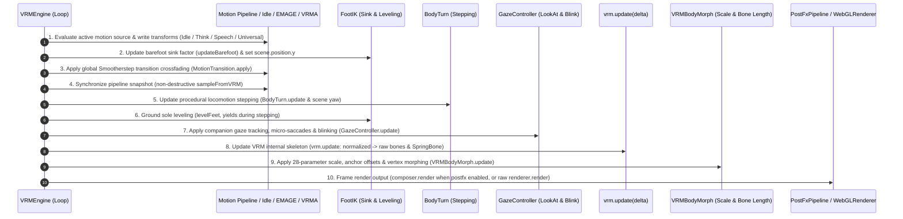

# Architecture Lifecycle, DevDrawer, Wardrobe System & Agent Engineering Rules

> **Core Files**:  
> - [`src/core/vrmEngine.ts`](../src/core/vrmEngine.ts) (Main render loop coordinator)  
> - [`src/core/material/vrmMaterialManager.ts`](../src/core/material/vrmMaterialManager.ts) (Wardrobe & material manager)  
> - [`src/components/dev-drawer/`](../src/components/dev-drawer/) (Debug drawer UI — section schema, slider architecture, collapse gate)  
> - [`src/config.ts`](../src/config.ts) (Central single source of truth)

---

## 1. Render Loop Frame Lifecycle Specification

Inside `VRMEngine.animate(time)`, the per-frame execution sequence (60 FPS) follows a strict anatomical and physical hierarchy. **Never alter this order**, and ensure downstream passes never overwrite upstream motion transforms:



### Critical Lifecycle Milestones:
- **Step 2 (Shoe-off Sink)**: Dynamic sink height must be applied to `vrm.scene.position.y` before bone computations so analytical two-bone IK can accurately reference the physical floor;
- **Step 5~6 (Stepping & Leveling)**: While `bodyTurn.isStepping()` is `true`, `levelFeet` must exit to preserve dynamic ankle flexion;
- **Step 8 (`vrm.update`)**: `@pixiv/three-vrm` transfers normalized transforms to raw humanoid bones;
- **Step 9 (`bodyMorph.update`)**: Scales bones, applies femoral/knee offsets, and updates abdominal vertices. **Never call `quaternion.copy(baseRot)` here** as it destroys the motion computed in Steps 1–8!
- **Step 10 (`PostFx / Render`)**: When `postfx.enabled` is true, routes through `PostFxPipeline` (UnrealBloom + ColorGrading + ToneMapping); when false, bypasses straight to `renderer.render` with zero overhead.

---

## 2. Wardrobe & Material Structure (VRoid Standard)

All clothing, accessory, and hair meshes are decoupled and categorized by [`src/core/material/vrmMaterialManager.ts`](../src/core/material/vrmMaterialManager.ts), driven by `APP_CONFIG.wardrobe`.

> [!NOTE]
> **概念区分**：
> - **部件级穿脱 (Wardrobe)**：针对当前模型的 mesh 部件可见性开关（如隐藏鞋子、隐藏外套），由 `WardrobeSection.tsx` 管理；
> - **整套无感换装 (Outfit Swap)**：跨模型资产重载与增量挂载（如切换女仆装/比基尼），由顶栏 [`TopHeader.tsx`](../src/components/TopHeader.tsx) 与 [`docs/OUTFIT_SWAP.md`](OUTFIT_SWAP.md) 管理。

### 2.1 Component Categories & Slot Definitions

| Category (`category`) | Component Slots (`id`) | Mesh Material Patterns & Classification Rules |
| :--- | :--- | :--- |
| **`clothing`** | `tops`<br/>`bottoms`<br/>`dress`<br/>`shoes`<br/>`socks`<br/>`underwear` | Matches semantic keywords (`tops`, `bottoms`, `dress`, `shoes`, `socks`, `underwear`). Hiding shoes triggers automatic FootIK sink. |
| **`accessory`** | `accessory` (Glasses, hats, earrings, ribbons, tails, horns) | Matches `glass`, `hat`, `ribbon`, `necklace`, `tail`, `horn`, `choker`, etc. |
| **`hair`** | `hair` (Hair meshes & spring bones) | Matches `hair` material. Controls 11 hair root bones and mesh visibility. |
| **`face`** | `face` (Facial meshes) | Matches `face`, `eye`, `eyebrow`, `mouth`, `tear`. |
| **`body`** | `body` (Avatar base body) | Matches `skin`, `body` base mesh textures. |

### 2.2 Developer API

```typescript
import { vrmEngine } from '@/core/vrmEngine';

// Hide shoes (triggers 4.6cm/3.9cm sink compensation and barefoot leveling)
vrmEngine.setClothingVisibility('shoes', false);

// Undress all outer garments (preserves base mesh and underwear)
vrmEngine.undressAllClothing();

// Restore all clothing items
vrmEngine.dressAllClothing();
```

---

## 3. DevDrawer Architecture

The debug drawer is an 8-section debug panel (`src/components/dev-drawer/`) shown only on localhost (includes `PostFxSection` and `EmagePerfSection`). Sections are schema-driven and each owns its own React state so per-frame UI work never cascades across sections.

### 3.1 Component Primitives

| Component | File | Role |
| :--- | :--- | :--- |
| `SectionCard` | `components/SectionCard.tsx` | Outer card. Optional `id` prop — when set, reads `collapsed.has(id)` from context and hides everything except the first child (the header). Without `id`, it's a plain visual wrapper. |
| `SectionHeader` | `components/SectionHeader.tsx` | Chevron + title + modified dot + per-section reset. Reads `collapsed` / `toggleCollapsed` from `useContext(DevDrawerContext)`. Renders a 1px `h-px bg-white/10 mt-2` divider below the title in expanded state. |
| `SectionRenderer` | `renderer.tsx` | `id → component` registry. `SECTIONS` schema in `schema.ts` provides the order; `REGISTRY` provides the component map. Adding a section = one line in `SECTIONS` + one in `REGISTRY`. |
| `SliderWithAnchors` | `src/components/SliderWithAnchors.tsx` | Radix slider + 1px anchor ticks for "100% center" and "config default". Supports both `onValueChange` (per-frame) and `onValueCommit` (release) callbacks. |

### 3.2 Per-Section State Isolation

Each section owns its `useState`. A 28-slider `BoneMorphSection` does **not** re-render its 27 sibling sliders when one slider drags — only the dragged `SliderWithAnchors` re-renders. This is the single most important property: it keeps mobile slider drag fluid despite a drawer full of controls.

### 3.3 Slider Drag Architecture (per-frame / commit split)

Drag-related callbacks have two paths:

| Callback | Fires | Use for |
| :--- | :--- | :--- |
| `onTick` (optional) | Every `pointermove` (60–120 Hz) | Direct engine write. Drives the canvas and Radix thumb position via `SliderWithAnchors`' local state. |
| `onChange` | `onValueCommit` (release / keyboard / tap) | React state update + `localStorage` write. Fires once per drag. |

Sections adopt this by defining two handlers — `handleSliderTick` (engine only) and `handleChange` (state + storage). `localStorage` is never written per-tick.

### 3.4 Live Value Display Without Re-render

The percentage text next to a slider (e.g. `90%`) lives in the section as a `<span>`. Updating React state per-tick would re-render the whole section. Instead, the section passes a `liveValueRef` + `liveValueFormatter` to `SliderWithAnchors`, which writes `ref.current.textContent = formatter(local)` imperatively from a `useEffect([local])`. The display follows the thumb in real time, but the section's React state stays at the committed value.

### 3.5 Modified Detection — Per-Section Baseline

`modified` is computed against a `useRef` baseline captured on mount, **not** against `APP_CONFIG` defaults. This is because the loaded VRM model (or a previous session's `localStorage`) may carry non-default values (e.g. `shoulderWidth = 1.55`), and the user should not see a "modified" dot just from opening the page. `modified` means "the user has changed something since the section mounted". The section's `handleReset` updates the baseline so the dot disappears after reset.

### 3.6 Global Reset Broadcast

`DevDrawerContext` carries a `resetSignal: number`. When the header "重置" button fires, the shell:
1. Resets every engine subsystem and writes defaults to `localStorage`.
2. Bumps `resetSignal`, which becomes part of `<SectionRenderer key={`${s.id}-${resetSignal}`}>`.

React unmounts and remounts every section on bump. Each section's `useState` initializer re-runs against the now-defaulted engine, so all 8 sections show their default state without per-section imperative sync.

### 3.7 Schema-Driven Render Order

`src/components/dev-drawer/schema.ts`:

```ts
export const SECTIONS: SectionConfig[] = [
  { id: 'expressions', defaultCollapsed: false },
  { id: 'camera',      defaultCollapsed: false },
  { id: 'saturation',  defaultCollapsed: false },
  { id: 'bodyMorph',   defaultCollapsed: false },
  { id: 'wardrobe',    defaultCollapsed: false },
  { id: 'lighting',    defaultCollapsed: false },
  { id: 'postfx',      defaultCollapsed: false },
  { id: 'emagePerf',   defaultCollapsed: false },
];
```

Current order: 预设表情 → 🎥 镜头设置 → 🎨 画面色彩 → ✨ 骨骼体型 → 🧩 模型部位 → 💡 灯光通道 → 🔮 后期效果 → ⚡ EMAGE Perf. Reordering = swapping entries in this array; no other file changes.

### 3.8 Section-Specific Patterns

- **Wardrobe (`WardrobeSection.tsx`)**: Each part row has 3 states — `穿` (checkbox on, normal), `未穿` (checkbox off, line-through, dim), `未装配` (dashed disabled div, no checkbox). `equippedCount` per category uses `vrmEngine.materialManager.partMaterials[p.id]?.length > 0` — not the user's visibility toggle — to distinguish "model has this part" from "user has hidden it".
- **Bone morph (`BoneMorphSection.tsx`)**: 28 sliders grouped into 7 body regions (overall / head / torso / hips / bust / arms / legs). Each category is a sub-card (`rounded-lg bg-white/[0.02] border`) with the label outside the card. Search filter hides empty regions.
- **Camera (`CameraSection.tsx`)**: 3 sliders — FOV (with hover `ⓘ` tooltip and bullet list of reference values), min / max camera distance. Body-turn toggle also lives here since it shares the camera concept. `defaultShotExtent` in `config.ts` controls how tall a body the default FOV frames.
- **PostFx (`PostFxSection.tsx`)**: Post-processing controller with bypass switch, ToneMapping mode capsule grid, and sliders for Bloom (strength/radius/threshold), Contrast, Brightness, Saturation, Hue, and Vignette. Full spec in [`docs/POSTFX.md`](POSTFX.md).
- **EMAGE Perf (`EmagePerfSection.tsx`)**: Localhost acceptance panel for P0b — `crossOriginIsolated`, SharedArrayBuffer, `numThreads`, wasm_env, stage timings. Screenshot-friendly; not a public product surface.

---

---

## 4. 🚨 Coding Agent Engineering Rules (Anti-Patterns)

Any AI Coding Agent working on this repository **must strictly obey these 5 rules**:

### ❌ Rule 1: Never Run `pnpm run build` for Routine Verification
- **Reason**: The project runs Vite + TanStack Start (SSR/Cloudflare Workers). Full builds are slow and disrupt the local HMR dev server;
- **User Directive**: *"No need to build every time, just verify with tsc!"*;
- **Only Approved Check Command**:
  ```bash
  pnpm exec tsc --noEmit
  ```
  The exit code must strictly be `0` with zero errors.

### ❌ Rule 2: Never Overwrite Bone `quaternion`s in Body Morphing
- **Reason**: Rotations belong 100% to the motion and stepping pipelines;
- **Past Pitfall**: Adding `quaternion.copy(baseRot)` inside `bodyMorph.apply()` paralyzed all leg movement during BodyTurn stepping;
- **Rule**: Morphing governs scale and translation. Except for differential tilt adjustments (e.g. non-zero `buttocksPitch` via `multiply`), **never reset quaternions to static rest poses**.

### ❌ Rule 3: Never Mutate `activePlayer` Inside Async Event Handlers
- **Reason**: The state machine must transition based on real-time module states (`isPlaying()`, `isThinking`);
- **Past Pitfall**: Setting `activePlayer = 'vrma'` upon clicking send caused a 1-frame visual flicker back to idle before thinking began;
- **Rule**: Let `activePlayer` be determined atomically inside the main render loop.

### ❌ Rule 4: Never Hardcode Avatar Heights or World Positions
- **Reason**: World coordinates shift dynamically with heel height, FootIK sink, and bone length sliders;
- **Rule**:
  - Query live height via `bodyMorph.getCurrentHeightCm()` (dynamically measured from mesh crown to ground $Y=0$);
  - Position joint offsets relative to parent local coordinates or world quaternions.

### ⚠️ Rule 5: Respect Single Source of Truth & SSR Hydration
- Global configuration constants must reside in [`src/config.ts`](../src/config.ts);
- Localization strings are anchored by [`src/i18n/zh-CN.ts`](../src/i18n/zh-CN.ts) (`Trans` type); all three languages (ZH, EN, JA) must remain 100% symmetric;
- Synchronize client and server language state via `document.cookie` and `readServerLang` to eliminate SSR hydration mismatches.
