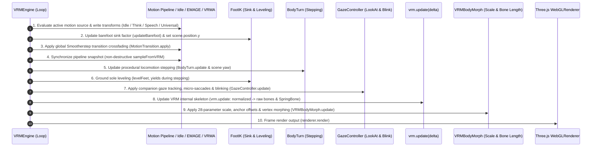

# Architecture Lifecycle, Wardrobe System & Agent Engineering Rules

> **Core Files**:  
> - [`src/core/vrmEngine.ts`](../src/core/vrmEngine.ts) (Main render loop coordinator)  
> - [`src/core/material/vrmMaterialManager.ts`](../src/core/material/vrmMaterialManager.ts) (Wardrobe & material manager)  
> - [`src/config.ts`](../src/config.ts) (Central single source of truth)

---

## 1. Render Loop Frame Lifecycle Specification

Inside `VRMEngine.animate(time)`, the per-frame execution sequence (60 FPS) follows a strict anatomical and physical hierarchy. **Never alter this order**, and ensure downstream passes never overwrite upstream motion transforms:



### Critical Lifecycle Milestones:
- **Step 2 (Shoe-off Sink)**: Dynamic sink height must be applied to `vrm.scene.position.y` before bone computations so analytical two-bone IK can accurately reference the physical floor;
- **Step 5~6 (Stepping & Leveling)**: While `bodyTurn.isStepping()` is `true`, `levelFeet` must exit to preserve dynamic ankle flexion;
- **Step 8 (`vrm.update`)**: `@pixiv/three-vrm` transfers normalized transforms to raw humanoid bones;
- **Step 9 (`bodyMorph.update`)**: Scales bones, applies femoral/knee offsets, and updates abdominal vertices. **Never call `quaternion.copy(baseRot)` here** as it destroys the motion computed in Steps 1–8!

---

## 2. Wardrobe & Material Structure (VRoid Standard)

All clothing, accessory, and hair meshes are decoupled and categorized by [`src/core/material/vrmMaterialManager.ts`](../src/core/material/vrmMaterialManager.ts), driven by `APP_CONFIG.wardrobe`:

### 2.1 Component Categories & Slot Definitions

| Category (`category`) | Component Slots (`id`) | Mesh Material Patterns & Classification Rules |
| :--- | :--- | :--- |
| **`clothing`** | `tops`<br/>`bottoms`<br/>`dress`<br/>`shoes`<br/>`socks`<br/>`underwear` | Matches semantic keywords (`tops`, `bottoms`, `dress`, `shoes`, `socks`, `underwear`). Hiding shoes triggers automatic FootIK sink. |
| **`accessory`** | `accessory` (Glasses, hats, earrings, ribbons, tails, horns) | Matches `glass`, `hat`, `ribbon`, `necklace`, `tail`, `horn`, `choker`, etc. |
| **`hair`** | `hair` (Hair meshes & spring bones) | Matches `hair` material. Controls 11 hair root bones and mesh visibility. |
| **`face`** | `face` (Facial meshes) | Matches `face`, `eye`, `eyebrow`, `mouth`, `tear`. |
| **`body`** | `body` (Avatar base body) | Matches `skin`, `body` base mesh textures. |

### 2.2 Developer API

```typescript
import { vrmEngine } from '@/core/vrmEngine';

// Hide shoes (triggers 4.6cm/3.9cm sink compensation and barefoot leveling)
vrmEngine.setClothingVisibility('shoes', false);

// Undress all outer garments (preserves base mesh and underwear)
vrmEngine.undressAllClothing();

// Restore all clothing items
vrmEngine.dressAllClothing();
```

---

## 3. 🚨 Coding Agent Engineering Rules (Anti-Patterns)

Any AI Coding Agent working on this repository **must strictly obey these 5 rules**:

### ❌ Rule 1: Never Run `pnpm run build` for Routine Verification
- **Reason**: The project runs Vite + TanStack Start (SSR/Cloudflare Workers). Full builds are slow and disrupt the local HMR dev server;
- **User Directive**: *"No need to build every time, just verify with tsc!"*;
- **Only Approved Check Command**:
  ```bash
  pnpm exec tsc --noEmit
  ```
  The exit code must strictly be `0` with zero errors.

### ❌ Rule 2: Never Overwrite Bone `quaternion`s in Body Morphing
- **Reason**: Rotations belong 100% to the motion and stepping pipelines;
- **Past Pitfall**: Adding `quaternion.copy(baseRot)` inside `bodyMorph.apply()` paralyzed all leg movement during BodyTurn stepping;
- **Rule**: Morphing governs scale and translation. Except for differential tilt adjustments (e.g. non-zero `buttocksPitch` via `multiply`), **never reset quaternions to static rest poses**.

### ❌ Rule 3: Never Mutate `activePlayer` Inside Async Event Handlers
- **Reason**: The state machine must transition based on real-time module states (`isPlaying()`, `isThinking`);
- **Past Pitfall**: Setting `activePlayer = 'vrma'` upon clicking send caused a 1-frame visual flicker back to idle before thinking began;
- **Rule**: Let `activePlayer` be determined atomically inside the main render loop.

### ❌ Rule 4: Never Hardcode Avatar Heights or World Positions
- **Reason**: World coordinates shift dynamically with heel height, FootIK sink, and bone length sliders;
- **Rule**:
  - Query live height via `bodyMorph.getCurrentHeightCm()` (dynamically measured from mesh crown to ground $Y=0$);
  - Position joint offsets relative to parent local coordinates or world quaternions.

### ⚠️ Rule 5: Respect Single Source of Truth & SSR Hydration
- Global configuration constants must reside in [`src/config.ts`](../src/config.ts);
- Localization strings are anchored by [`src/i18n/zh-CN.ts`](../src/i18n/zh-CN.ts) (`Trans` type); all three languages (ZH, EN, JA) must remain 100% symmetric;
- Synchronize client and server language state via `document.cookie` and `readServerLang` to eliminate SSR hydration mismatches.
