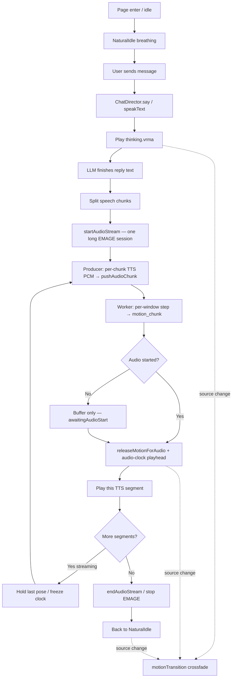

# Chat Director & Streaming Multimodal Pipeline

> **Core Files**:  
> - [`src/director/chatDirector.ts`](../src/director/chatDirector.ts) (Director orchestration & pipeline scheduler)  
> - [`src/components/HeadBubble.tsx`](../src/components/HeadBubble.tsx) (3D head bubble & status capsules)  
> - [`src/motion/speakIdle.ts`](../src/motion/speakIdle.ts) (Speech-gap biomechanical micro-motion)  
> - [`src/server.ts`](../src/server.ts) (Edge-TTS proxy + COOP/COEP document isolation)
> - [`src/motion/emageWorker.ts`](../src/motion/emageWorker.ts) / [`emagePlayer.ts`](../src/motion/emagePlayer.ts) (streaming `motion_chunk`)
> - [`EMAGE_MODEL.md`](EMAGE_MODEL.md) (EP / INT8 / limits)

---

## 1. System Vision & Streaming Architecture

In multimodal conversational agents, the primary UX bottleneck is not single-token throughput, but **Time To First Audio (TTFA)** and **audio playback stalling**.
Waiting for complete LLM responses before generating speech and motion leaves the user staring at a frozen character for $5\sim 10\text{ seconds}$.

`ChatDirector` coordinates the Large Language Model (WebLLM / custom providers), speech synthesis (Edge-TTS), gesture synthesis (EMAGE), and 3D rendering into a **high-concurrency streaming pipeline**:

```mermaid
sequenceDiagram
    autonumber
    actor User
    participant LLM as WebLLM / API (LLM)
    participant Director as ChatDirector (Scheduler)
    participant Slicer as Smart Slicer (30~60 chars)
    participant TTS as Edge-TTS (Parallel Pre-fetch)
    participant Worker as EMAGE Worker (Motion Gen)
    participant Player as Audio + 3D Render

    User->>Director: User message: "Tell me about today's weather"
    Director->>Player: Engage thinking.vrma posture & gaze shift immediately
    Director->>LLM: Stream text response
    LLM-->>Director: First text tokens arrive
    Director->>Slicer: Slice text stream into semantic chunks (Chunk 1, Chunk 2...)
    par Concurrent Pre-fetch
        Director->>TTS: Promise.all pre-fetches audio for all available chunks
        Director->>Worker: Synthesize EMAGE gestures upon first audio chunk arrival
    end
    Note over Director,Player: Buffer meets preload threshold (1~2 chunks) -> Begin playback!
    Director->>Player: Switch to speaking state; play audio + full-body gesture + LipSync
    Director->>Director: Background workers process Chunks 2, 3... (0ms gapless playback)
```

---

## 2. Algorithms & Pipeline Mechanisms

### 2.1 Smart Speech Chunk Slicer (`splitIntoSpeechChunks`)

To balance prompt first-sentence responsiveness with natural cadences:
1. **Short Text Passthrough**: Texts $\le 45\text{ characters}$ are dispatched as a single chunk for immediate playback;
2. **Punctuation-First Boundary Alignment**:
   - Prefer sentence boundaries (`。！？!?\n` or `.\s`) between **$25 \sim 65\text{ characters}$**;
   - Fall back to commas or semicolons (`，,；;`) between **$25 \sim 60\text{ characters}$**;
   - Hard slice at character 55 only if no punctuation is found, preserving word integrity.

---

### 2.2 Concurrent Pre-fetch & Dual-Condition Preloading

Serial generation is a common pitfall (Sentence 1 finishes $\to$ Request Sentence 2 $\to$ lag spike).
`ChatDirector` enforces **aggressive concurrency with adaptive preload buffers**:

1. **Parallel Pre-fetch**:
   As soon as chunks are sliced, `Promise.all` issues concurrent requests to Edge-TTS, compressing queue wait times to $0\text{ms}$;
2. **Adaptive Preload Buffer**:
   Determines the minimum buffer size needed before audio playback starts:
   $$\text{targetPreload} = \min\Big(2, \; \min\big(N, \; \max(1, \; \lceil N/3 \rceil)\big)\Big)$$
   - Short replies ($1\sim 2\text{ chunks}$): Starts playback immediately on the 1st chunk;
   - Long discourse ($\ge 3\text{ chunks}$): Preloads 2 chunks ($\sim 8\sim 12\text{s}$ of audio), ensuring all subsequent chunks finish synthesis in the background before the queue drains.

---

### 2.3 Gapless Speech-Idle Takeover (`SpeakIdleSystem`)

If network latency temporarily delays the subsequent chunk:
- The avatar avoids snapping back to an upright `NaturalIdle`;
- The system smoothly engages `SpeakIdleSystem` (floating hand gestures, slight knuckle flex, contemplative head tilt);
- When the next chunk arrives, it seamlessly resumes speaking without visual stutter.

---

### 2.4 Head Bubble & Anti-Spoil Rules (`HeadBubble.tsx`)

Dialogue bubbles strictly follow the **Anti-Spoil Principle**:

| Interaction Phase | Status Key (`statusKey`) | Visual Presentation | Core Constraint |
| :--- | :--- | :--- | :--- |
| **Thinking** | `'thinking'` | Purple capsule: `💭 Thinking...` | Never show raw generated text before speech starts |
| **TTS Synthesis** | `'tts'` | Blue capsule: `🎙️ Preparing voice...` | Maintains conversational pacing |
| **EMAGE Synthesis** | `'emage'` | Amber capsule: `✨ Rehearsing gestures...` | Displays pipeline state only |
| **Active Speech** | `'speaking'` | **Expands full speech bubble with text** | **Reveals dialogue text exclusively when audio & motion play!** |

---

### 2.5 Streaming EMAGE (`motion_chunk`) & A/V Hold

Beyond sentence-level TTS pre-fetch, EMAGE itself streams **inside** each speech chunk:

1. Worker steps fixed **T=64** windows and posts transferable **`motion_chunk`** after each successful `runStep` (TTFA — gestures can start before the full utterance finishes).
2. **A/V hold**: the first chunk is buffered; visible motion releases only when TTS `AudioContext.start` calls `releaseMotionForAudio`, so motion never leads audible audio.
3. Hop / seam behavior is owned by `APP_CONFIG.emage.motion` (`advanceFrames` 60..64, seam + micro-fade knobs). Document COOP/COEP isolation enables SAB wasm threads when available (P0b).

Details and non-goals (no WebGPU-EMAGE, no P0d): [`EMAGE_MODEL.md`](EMAGE_MODEL.md).

## 3. Developer Configuration Quick Reference

- **Voices & Pitch**: Configured centrally in [`src/config.ts`](../src/config.ts):
  - Chinese: `zh-CN-XiaoyiNeural` (+10% pitch for a bright anime companion voice);
  - English: `en-US-AnaNeural`;
  - Japanese: `ja-JP-NanamiNeural`.
- **Interrupting Speech**:
  ```typescript
  // Interrupt ongoing speech and flush queues upon new user prompts
  vrmEngine.chatDirector.resetClipCache();
  ```


---

## Flow: enter → message → source switch → speak → idle (tip)

High-level path from idle through a spoken reply. **Source priority** in the render loop: `universal` > `emage` > `vrma` (thinking) > `idle`.

`MotionTransitionManager` runs **only when the active source changes** (e.g. idle→thinking, thinking→emage, emage→idle). It does **not** run per `motion_chunk`; window seams are handled inside `EmagePlayer` (see [`EMAGE_MODEL.md`](EMAGE_MODEL.md) Worker diagram).



Bubble status roughly tracks: `thinking` → early `emage` (first window ready) → `speaking` → inter-segment wait → idle.
