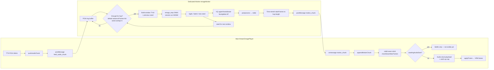

# EMAGE On-Device Model — Status & Known Limits

> **State captured on tip**: `perf/edge-inference` (the branch is expected to merge; re-validate after main-line merges change worker / config / config.ts `useInt8`).
> **Core files**: [`src/motion/emageWorker.ts`](../src/motion/emageWorker.ts), [`src/motion/emagePlayer.ts`](../src/motion/emagePlayer.ts), [`src/config.ts`](../src/config.ts) (`APP_CONFIG.emage`), [`src/components/dev-drawer/sections/EmagePerfSection.tsx`](../src/components/dev-drawer/sections/EmagePerfSection.tsx)  
> **Export upstream**: [VolgaGerm / emage-onnx-export](https://github.com/VolgaGerm/emage-onnx-export) — **README-documented scripts only** (`export_onnx.py`, `--quantize`, etc.). Non-README converters are not part of the supported path.
> **Weights shipped**: R2 hosts both **FP32** (504 MB on `emage_step.onnx`) and **INT8** (~167 MB on `emage_step_int8.onnx`) variants of every model. The browser download path is chosen by `useInt8` in `src/config.ts` (`q()` rewrites filenames to `_int8.onnx` when true). Tip ships with `useInt8 = true`; the FP32 row is kept as a fallback for users who need the fidelity.

This page records what is **shipped and true** for browser EMAGE on the current tip. It does **not** invent latency numbers.

---

## 1. What runs in the browser today

| Item | Status on tip |
| :--- | :--- |
| Runtime | ONNX Runtime Web inside a **Dedicated Web Worker** |
| Execution provider | **`wasm` only** (`executionProviders: ['wasm']`) |
| Quantization | **INT8 dynamic PTQ already on** (`useInt8 = true` → `*_int8.onnx`); FP32 weights exist on R2 as a fallback |
| Window length | Fixed **T=64** frames per step (model export contract) |
| Streaming | Per-window **`motion_chunk`** posts after each successful `runStep` (TTFA path) |
| A/V sync | First chunk buffered until TTS `AudioContext.start` → `releaseMotionForAudio` (motion does not lead audible audio) |
| Isolation / threads | **P0b**: COOP `same-origin` + COEP `credentialless` on document responses; when `crossOriginIsolated`, SharedArrayBuffer + ORT wasm multi-thread (capped); step scratch reused across windows |
| Hop / seams | **E1+E2 / P0c** knobs under `APP_CONFIG.emage.motion` (see §4) |
| Face / global VQ | **`vqFace` / `vqGlobal` disabled** in config (zeros / skip load) |
| Parallel VQ decode | **Not viable** on ORT WASM (`Promise.all` → “Session already started”); VQ runs **sequentially** |
| WebGPU for EMAGE | **Not shipped** — blocked by **`int64`** tensors in `speaker_id` and VQ `indices`; **E3-① closed** ([see §2](#2-why-emage-stays-on-wasm-e3--closed)) |
| P0d residual-gate | **Not shipped** |

**Contrast with LLM**: WebLLM **may** use WebGPU. EMAGE does **not**.

**E3-①** is the project's internal investigation label for the int32-cast + WebGPU-EMAGE feasibility study; it is referenced here only so internal readers can map this doc back to the original tickets. External readers can ignore the label.

---

## 1.1 Wall-clock reality (qualitative)

The dominant cost remains the **serial autoregressive `runStep`** on wasm (one window after another). Decode is comparatively cheap on tip profiling. Hop `advanceFrames` in **60..64** only changes window count modestly (on the order of a few percent fewer windows at 64 vs 60) — it is **not** a large wall-clock cut. Measure on-device; do not copy ms from docs into marketing.

**One data point on tip profile (mid-range mobile, INT8 path, single observation — NOT an SLA):**

- `step` (Transformer): **0.7–1.0 s / 64-frame window**
- `decode_checkpoint` (VQ heads + smooth): **80–120 ms / checkpoint**
- 15 s of speech ⇒ roughly **8 s of inference** plus TTS network round-trip

These are a single observation; they shift per device, per session, per browser version, per `numThreads`. Treat as one sample of the order of magnitude, not a target number.

## 2. Why EMAGE stays on wasm (E3-① closed)

EMAGE graphs and feeds use **`int64`** tensors (e.g. `speaker_id`, VQ `indices`). ORT WebGPU int64 support is incomplete / unsafe for production (shader paths often only the low 32 bits). E3-① evaluated int32+WebGPU as an optional acceleration path and **closed without shipping**: production remains **wasm + INT8**, with WebGPU reserved for the LLM path only.

> **E3-① context**: this was the project's int32 / WebGPU-EMAGE feasibility investigation. Its conclusion ("EMAGE stays on wasm + INT8") is the reason §1 lists "WebGPU for EMAGE — Not shipped". Nothing in this doc should be read as a roadmap item; if the conclusion is ever revisited, this section is the one to update first.

Do **not** document or advertise "EMAGE on WebGPU" as a shipped feature.

---

## 3. Streaming pipeline (qualitative)

1. Director feeds PCM into the Worker in streaming fashion.
2. Worker accumulates audio to a **T=64** window, runs `emage_step`, decodes enabled VQ heads + `postprocess`, then posts a transferable **`motion_chunk`**.
3. Player appends chunks; the **first** visible release waits for audible TTS start (A/V hold).
4. Across speech segments, latent **seed carryover** (`continueFromPrevious` / last-4-frame seed) keeps autoregressive continuity.
5. Seam / hop behavior is config-driven (next section), not hardcoded magic constants in docs.

No wall-clock ms claims here — measure on device via `EmagePerfSection` / console stage profiles.

---

---

## 3.1 Flow: PCM → step → decode → motion_chunk → seam (one window)

One autoregressive window inside the Dedicated Worker, then main-thread seam + A/V gate. Dominant cost is serial **`runStep`** on wasm; VQ decode is comparatively cheap. Hop is `APP_CONFIG.emage.motion.advanceFrames` (legal **60..64**).

**Read order (one window):** PCM in → hop full → step → VQ+postprocess → `motion_chunk` → Player seam → hold until audible TTS → playhead follows audio clock. A full utterance repeats this loop until `feed_audio_end` / checkpoint tail.

Orchestration around this loop (thinking VRMA, source switches): [`CHAT_DIRECTOR.md`](CHAT_DIRECTOR.md). Layering with idle / bodyTurn / FootIK: [`MOTION_PIPELINE.md`](MOTION_PIPELINE.md).

## 4. `APP_CONFIG.emage.motion` knobs (hop & seams)

Authoritative defaults live in [`src/config.ts`](../src/config.ts). Agents and humans should edit **there**, not scatter literals.

Notable fields:

| Key | Role (summary) |
| :--- | :--- |
| `advanceFrames` | PCM **hop** frames per step; legal **60..64** (EFF..WINDOW). Higher → fewer steps; lower → denser windows / more work. Worker clamps &gt;64. |
| `chunkSeamMaxFrames` | Max frames used when blending chunk seams |
| `seamJumpThreshold` / `seamJumpFramesScale` | Skip or size geometric seam repair from L2 jump |
| `poseMicroFadeJumpDiv` / `MinSec` / `MaxSec` / `JumpMin` | Micro crossfade `duration = clamp(MinSec, MaxSec, jump / JumpDiv)`; fires only when L2 jump &gt; `JumpMin`. Reads at `src/motion/emagePlayer.ts:169-172, 690-695`. |
| `streamingCatchUpRate` | How aggressively playhead may catch the audio clock (&gt;1 risks yank) |
| `dampingStiffness` / `temporalSmoothRadius` | Inertia + Gaussian temporal smooth |
| `vqSampleTemperature` / `vqSampleTopK` | Upper/hands VQ sampling (lower body stays argmax) |
| Intensity fields | Per-region gesture scale (arms, fingers, torso, …) |

---

## 5. Models enabled / disabled

Configured under `APP_CONFIG.emage.models` (filenames go through `q()` when `useInt8`):

- **Enabled (typical)**: `emage_step`, upper/hands/lower VQ index decoders, `postprocess`.
- **Disabled**: `vqFace` (106D face — zeros fed to postprocess), `vqGlobal` (root translation; stance locked by FootIK).

Re-enable only when the product needs facial VQ or free locomotion root motion — and accept the extra download + decode cost.

---

## 6. Export & weights policy

- **Supported export**: scripts and flags documented in the **emage-onnx-export README** (`export_onnx.py`, `--quantize`, `--streaming-only`, `--no-face`, `--no-lower`, …).
- **Unsupported for production claims**: ad-hoc / non-README converters (e.g. experimental int64→int32 tools) until they are promoted into that README and validated.
- Browser loads INT8 artifacts when `useInt8` is true; FP16 browser path is intentionally not enabled (dtype edge cases).

---

## 7. Isolation checklist (P0b)

For multi-thread wasm:

1. Document must be **`crossOriginIsolated`** (COOP + COEP `credentialless` from `src/server.ts` / Vite / `_headers`).
2. `SharedArrayBuffer` available in the Worker.
3. `ort.env.wasm.numThreads` &gt; 1 (capped in Worker to leave headroom for WebLLM + render).

`EmagePerfSection` is the localhost UI for screenshotting these fields — not a public user feature.

---

## 8. Explicit non-goals on this tip

- WebGPU-EMAGE / hybrid physics for EMAGE  
- P0d residual-gate  
- Parallel multi-session VQ on ORT WASM  
- Fake or copied millisecond SLAs in marketing / GEO copy  

For director-level TTS chunking and bubble anti-spoil rules, see [`CHAT_DIRECTOR.md`](CHAT_DIRECTOR.md). For layered VRM blending, see [`MOTION_PIPELINE.md`](MOTION_PIPELINE.md). For WebLLM vs Worker placement, see [`ON_DEVICE_AI.md`](ON_DEVICE_AI.md).
