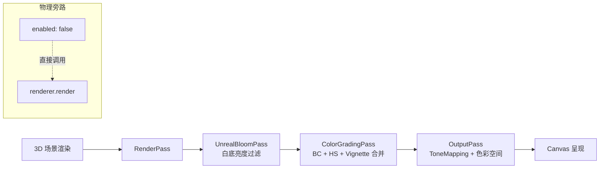

# Post-Processing Pipeline (二次元后期渲染管线)

> **核心文件**：  
> - [`src/core/postfx/postFxPipeline.ts`](../src/core/postfx/postFxPipeline.ts) (后期处理管线实现与着色器)  
> - [`src/components/dev-drawer/sections/PostFxSection.tsx`](../src/components/dev-drawer/sections/PostFxSection.tsx) (DevDrawer 控制面板)  
> - [`src/config.ts`](../src/config.ts) (`APP_CONFIG.postfx` 默认参数与上下限)

---

## 1. 设计目标与核心架构

在二次元（NPR / Cel-shading）渲染中，常规 3D 游戏的后期处理（如强烈的泛光、高对比 ToneMapping、胶片暗角）往往会带来两大灾难：
1. **白底起雾**：在纯白或浅色背景下，全屏 Bloom 会把背景当作超高亮源，导致整个画面泛白、人物轮廓被严重吞噬；
2. **肤色泛灰泛黄**：写实级的 ACESFilmic 或 Neutral 会压缩高光与中间调，导致二次元角色白皙红润的肤色变成灰黄脏色。

本项目构建了专为二次元二倍体 NPR 量身定制的 **`PostFxPipeline`**，具备以下特性：



---

## 2. 管线各阶段技术规范

### 2.1 物理旁路机制 (Zero-Cost Bypass)
- 当 `enabled = false` 时，渲染循环 **100% 跳过** `EffectComposer`，直接回退到原生的 `renderer.render(this.scene, this.camera)`；
- 杜绝非开启状态下的额外 FBO 创建、RenderTarget 切换与全屏 Quad 绘制开销。

### 2.2 防白底起雾 UnrealBloomPass
- **着色器层过滤白底**：修改 LuminosityHighPass 着色器逻辑，专门剔除接近 `(1.0, 1.0, 1.0)` 的高亮白底，确保 Bloom 只作用于角色发丝、衣物高光与金属饰品；
- **默认推荐参数**（经实测精调）：
  ```typescript
  bloom: {
    strength: 0.015, // 微量辉光，发丝通透柔和，绝不起雾
    radius: 0.32,    // 散焦半径
    threshold: 0.72  // 高光阈值
  }
  ```

### 2.3 单 Pass 合并调色 (Merged ColorGradingPass)
避免多 Pass 带来的多重全屏读写，我们将三项常用调整合并入单个自定义 ShaderPass：
1. **BC (Brightness & Contrast)**：
   - 线性对比度公式：`color = (color - 0.5) * (1.0 + contrast) + 0.5 + brightness`；
   - 默认微增 `contrast: 0.02`，使瞳孔更加清澈通透。
2. **HS (Hue & Saturation)**：
   - RGB ↔ HSV 转换；在 `saturation == 0 && hue == 0` 时自动分支跳过昂贵三角计算。
3. **Vignette (暗角)**：
   - 浅色白底模式下默认关闭（`darkness: 0.0`），避免浅底边缘出现一圈灰脏晕影。

### 2.4 色调映射 (Tone Mapping) 胶囊选择
提供 5 种模式实时切换：
| 模式 | Three.js 常量 | 特性与适用场景 |
| :--- | :--- | :--- |
| **Linear (默认)** | `THREE.LinearToneMapping` | **二次元首选**。原色直出，不压缩肤色，配合 `exposure: 1.05` 白皙纯净。 |
| **ACESFilmic** | `THREE.ACESFilmicToneMapping` | 电影级高动态对比，适合重度光影与暗黑风格。 |
| **Neutral** | `THREE.NeutralToneMapping` | Khronos 官方物理写实映射，但在浅色二次元下容易让皮肤偏灰。 |
| **Reinhard** | `THREE.ReinhardToneMapping` | 经典柔和高光压缩。 |
| **Cineon** | `THREE.CineonToneMapping` | 胶片感曲线。 |

---

## 3. DevDrawer 控制面板 (`PostFxSection.tsx`)

位于开发调试抽屉第 7 段，支持以下交互特性：
1. **总开关与指示灯**：独立 Switch 控制，关闭时面板参数平滑淡出锁定；
2. **ToneMapping 胶囊网格**：网格排布的胶囊按钮组，实时高亮当前映射模式；
3. **滑块 Anchor 刻度**：每个滑块均标有 100% 基准与 Config 默认锚点；
4. **多语言支持**：集成 zh-CN / en / ja 三语词条。
