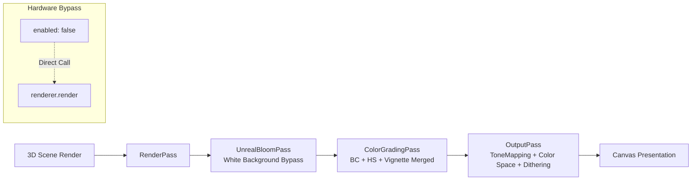

# Post-Processing Pipeline (PostFxPipeline)

> **Core Files**:  
> - [`src/core/postfx/postFxPipeline.ts`](../src/core/postfx/postFxPipeline.ts) (Post-processing pipeline implementation and custom shaders)  
> - [`src/components/dev-drawer/sections/PostFxSection.tsx`](../src/components/dev-drawer/sections/PostFxSection.tsx) (DevDrawer control panel)  
> - [`src/config.ts`](../src/config.ts) (`APP_CONFIG.postfx` default parameters and slider limits)

---

## 1. Design Objectives & Architecture Overview

In anime NPR (Non-Photorealistic Rendering / Cel-shading), generic post-processing configurations typical of realistic 3D games (such as aggressive screen bloom, heavy tone mapping curves, and dark vignetting) introduce two severe visual regressions:
1. **White-Background Fogging (Bloom Blowout)**: In bright or pure white outdoor scenes (e.g. minimalist linework), full-screen bloom treats high-luminance background pixels as glow emitters, causing the entire image to blow out in white haze and engulfing character silhouettes.
2. **Skin Tone Desaturation & Muddy Yellowing**: Realistic tone mappers (like ACESFilmic or Neutral) heavily compress highlights and midtones, turning fair, vibrant anime skin tones into dull grey or yellow hues.

To resolve these challenges, Project XiaoChun implements a tailored **`PostFxPipeline`** with the following pipeline structure:



---

## 2. Stage-by-Stage Technical Specifications

### 2.1 Physical Zero-Cost Render Bypass
- When `enabled = false`, the render loop **100% bypasses** `EffectComposer`, directly invoking native `renderer.render(this.scene, this.camera)`;
- Completely eliminates redundant FBO allocations, RenderTarget context switches, and full-screen quad blits during disabled states.

### 2.2 Anti-Fogging UnrealBloomPass (Background Luminance Bypass)
- **Shader-level White Filtering**: Modifies the `LuminosityHighPass` shader logic to selectively reject pixels approaching pure white `(1.0, 1.0, 1.0)`. Bloom is strictly constrained to character hair highlights, clothing specular, and metallic accessories.
- **Calibrated Production Defaults**:
  ```typescript
  bloom: {
    strength: 0.015, // Subtle glow, transparent and soft hair edges, zero fogging
    radius: 0.32,    // Diffusion radius
    threshold: 0.72  // Specular threshold
  }
  ```

### 2.3 Merged Single-Pass Color Grading (ColorGradingPass)
To minimize memory bandwidth and multi-pass draw overhead, three adjustments are consolidated into a single custom `ShaderPass`:
1. **BC (Brightness & Contrast)**:
   - Linear contrast formula: `color = (color - 0.5) * (1.0 + contrast) + 0.5 + brightness`;
   - Defaults to a subtle `contrast: +0.02` to enhance iris depth and clarity.
2. **HS (Hue & Saturation)**:
   - Optimized RGB $\leftrightarrow$ HSV conversion; short-circuits trigonometric math when `saturation === 0 && hue === 0`.
3. **Vignette**:
   - Disabled by default in bright scenes (`darkness: 0.0`), preventing unsightly dirty halos around character perimeters.

### 2.4 Tone Mapping Modes
Provides runtime switching across 5 tone mapping algorithms:
| Mode | Three.js Constant | Characteristics & Target Scenarios |
| :--- | :--- | :--- |
| **Linear (Default)** | `THREE.LinearToneMapping` | **Anime Recommended**. Pure color straight-through; preserves fair skin tones without midtone compression; paired with `exposure: 1.05`. |
| **ACESFilmic** | `THREE.ACESFilmicToneMapping` | Cinematic high dynamic contrast; best for heavy shadows and dark scenes. |
| **Neutral** | `THREE.NeutralToneMapping` | Khronos PBR standard tone curve; slightly compresses skin tones in anime settings. |
| **Reinhard** | `THREE.ReinhardToneMapping` | Classic soft highlight roll-off. |
| **Cineon** | `THREE.CineonToneMapping` | Film-stock response curve. |

### 2.5 Jimenez IGN 8-Bit Dithering (Anti-Banding & Circular Halo Elimination)
In dark mode or high-contrast scenes, the subtle falloff of Gaussian bloom and smooth background gradients can cross the 8-bit framebuffer quantization threshold (e.g. from `rgb(16, 16, 16)` to `rgb(15, 15, 15)`). Due to Mach Banding and human contrast sensitivity (Weber's law), this produces visible stepped rings (circular halos) around character hair and highlights.

To eliminate this artifact without incurring heavy compute penalties:
- Injected into the final `OutputPass` immediately following tone mapping and `sRGBTransferOETF`:
  ```glsl
  // Jimenez Interleaved Gradient Noise (IGN) 8-bit high-frequency dithering:
  float ign = fract(52.9829189 * fract(dot(gl_FragCoord.xy, vec2(0.06711056, 0.00583715))));
  gl_FragColor.rgb += (ign - 0.5) / 255.0;
  ```
- Statistically dithers the transition boundary over adjacent pixels, smoothly dispersing 1-bit quantization steps into human-imperceptible continuous gradients.

---

## 3. DevDrawer Control Interface (`PostFxSection.tsx`)

Integrated as Section 7 in the developer drawer:
1. **Master Switch with Live Indicator**: Toggle switch with animated state lock/fade-out when disabled;
2. **ToneMapping Capsule Grid**: Interactive pill button matrix displaying real-time active mode;
3. **Calibrated Anchor Sliders**: Every slider features tick marks indicating 100% baseline and config defaults;
4. **Trilingual Support**: Fully localized in English, Chinese (zh-CN), and Japanese (ja).
