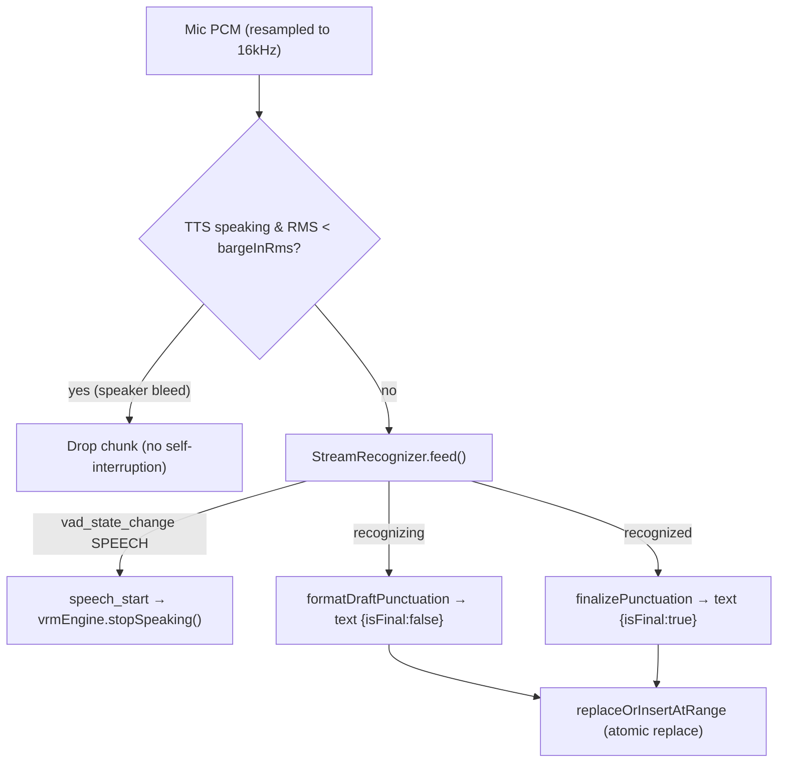

# On-Device Streaming STT (`STT.md`)

> **Core Files**:
> - [`src/stt/sttClient.ts`](../src/stt/sttClient.ts) — mic capture, `StreamRecognizer` (`@firetable/stream-asr`) bridge, acoustic bleed gating & barge-in guard, bounded PCM buffer
> - [`src/stt/punctuation.ts`](../src/stt/punctuation.ts) — heuristic punctuation (`formatDraftPunctuation`, `finalizePunctuation`) applied to interim / final text
> - [`src/components/ChatBar.tsx`](../src/components/ChatBar.tsx) — atomic in-place range replacement (`replaceOrInsertAtRange`), IME composition protection
> - [`src/config.ts`](../src/config.ts) — `APP_CONFIG.stt` (`modelUrl`, `wasmBaseUrl`, `vadThreshold`, `bargeInRms`, `ttsCooldownMs`)

## 1. Architecture

ChatBar dictation is **100% browser-native, single-pass streaming**, powered by [`@firetable/stream-asr`](https://github.com/FireTable/stream-asr) (WebAssembly SIMD, Mode 3: continuous streaming + neural VAD). Audio never leaves the device.

```mermaid
flowchart TD
    Mic["Mic PCM (resampled to 16kHz)"] --> Bleed{"TTS speaking & RMS < bargeInRms?"}
    Bleed -- "yes (speaker bleed)" --> Drop["Drop chunk (no self-interruption)"]
    Bleed -- "no" --> Feed["StreamRecognizer.feed()"]
    Feed -- "vad_state_change SPEECH" --> BargeIn["speech_start → vrmEngine.stopSpeaking()"]
    Feed -- "recognizing" --> Draft["formatDraftPunctuation → text {isFinal:false}"]
    Feed -- "recognized" --> Final["finalizePunctuation → text {isFinal:true}"]
    Draft --> Replace["replaceOrInsertAtRange (atomic replace)"]
    Final --> Replace
```

There is **no Two-Pass** stage: interim drafts and finals both come from the same on-device engine, so text never jumps due to a cloud re-transcription.

## 2. Model & Runtime

| Item | Location |
| :--- | :--- |
| Model manifest + chunks | `https://cdn.firetable.tech/stream-asr/v1/model_chunks/model.json` (override: `VITE_STREAM_ASR_MODEL_URL`) |
| WASM runtime | same-origin `/wasm/` (`public/wasm`, override: `VITE_STREAM_ASR_WASM_BASE`) |
| Cache | IndexedDB (managed by the SDK), offline after first download |

The model is downloaded lazily on first mic activation; `progress` events carry `percent` in **0–100**.

## 3. Behaviour Invariants

- **Acoustic bleed guard**: while TTS speaks (plus `ttsCooldownMs` tail), chunks with RMS `< bargeInRms` are dropped; louder input is treated as barge-in.
- **Bounded PCM buffer**: PCM kept for DevDrawer `utterance_result` is capped (~0.5 s preroll in silence, ~30 s per utterance) — never grows unbounded while the mic is idle.
- **Init failure is recoverable**: a failed `init()` resets state to `error` and allows retry on the next mic click.
- **IME safety**: while composing, STT text is queued and flushed on `compositionend`.

## 4. Cloud STT (hidden, retained)

The Cloudflare Workers AI endpoint (`POST /api/stt`, `src/server/sttHandler.ts`) and the custom-provider STT plumbing (`activeAudioModes.ts`, `customProvider/`) are **kept in the codebase but have no UI entry** — the settings dialog only exposes LLM and TTS tabs. `SttClient` always uses the on-device engine.
